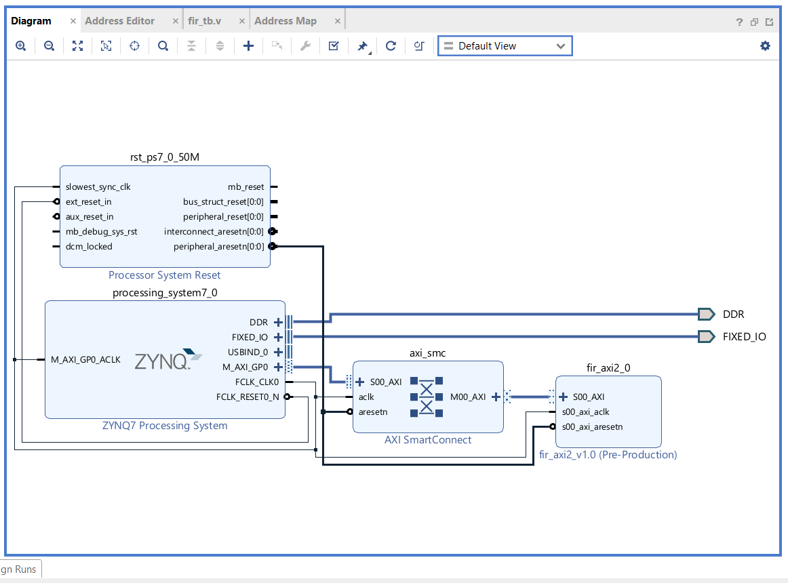
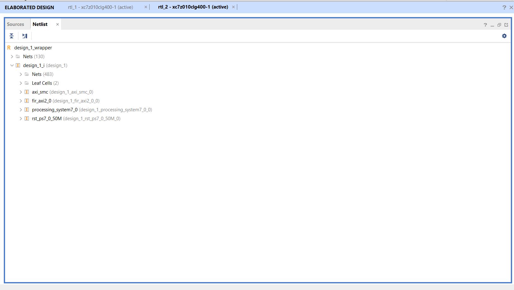
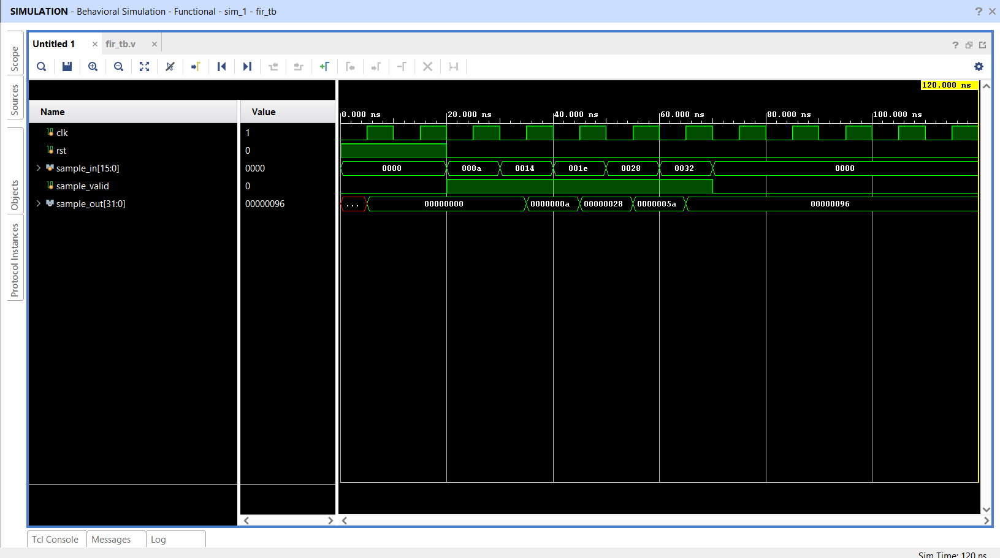
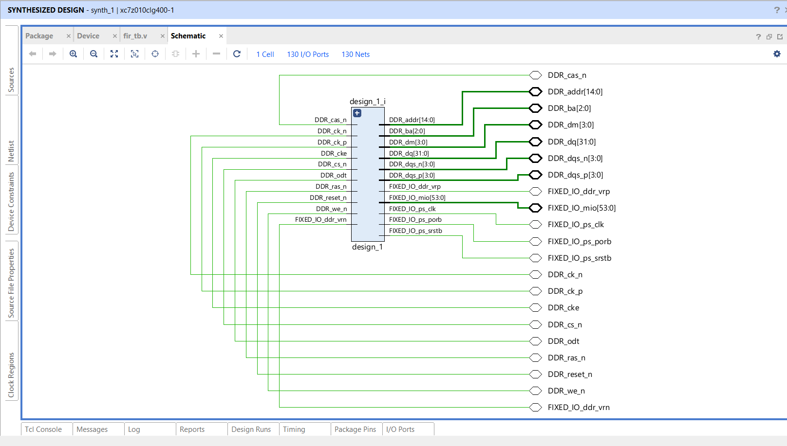
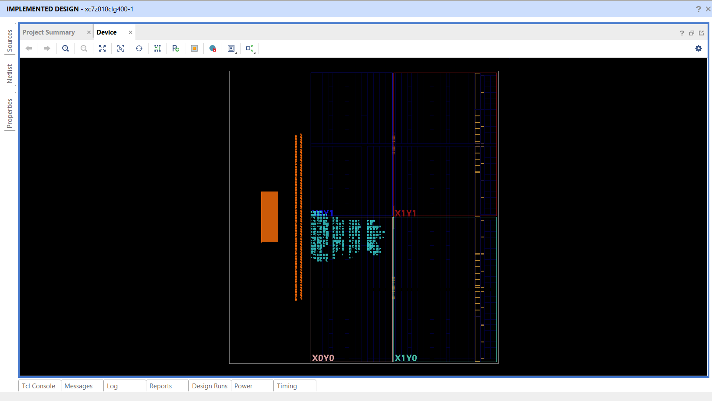
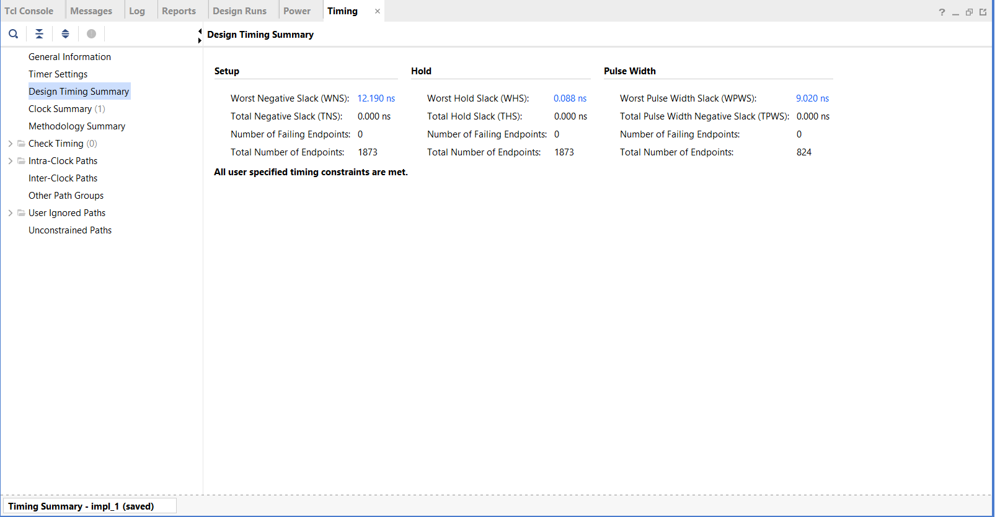
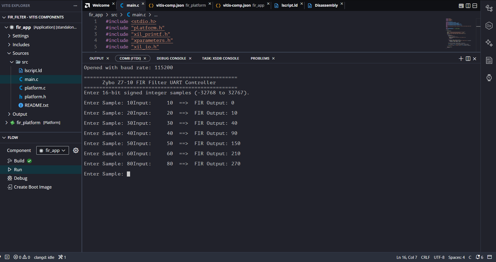

# 4-Tap FIR Filter with AXI4-Lite Interface on Zynq-7000 FPGA

## Project Overview

This project presents the design and implementation of a **4-Tap Finite Impulse Response (FIR) Filter** using **Verilog HDL**. The FIR filter was integrated as a **custom AXI4-Lite peripheral** in **Xilinx Vivado**, connected to the **Zynq-7000 Processing System**, and verified using a **Vitis C application** through UART communication.

The project demonstrates the complete FPGA development workflow, from RTL design and simulation to hardware implementation and software-driven verification.

---

## Key Features

- 4-Tap FIR Filter designed in Verilog HDL
- Functional verification using a custom Verilog Testbench
- Custom AXI4-Lite Peripheral Development
- Integration with Zynq-7000 Processing System
- UART-based communication using Vitis
- RTL Simulation
- Logic Synthesis
- FPGA Implementation
- Timing Analysis

---

## Tools Used

- Xilinx Vivado
- Xilinx Vitis
- Verilog HDL
- AXI4-Lite
- UART

---

## Repository Structure

```
axi_ip/
│
├── fir_axi2.v
└── fir_axi2_slave_lite_v1_0_S00_AXI.v

verilog/
│
├── fir_filter.v
└── fir_tb.v

vitis/
│
└── main.c

images/
│
├── block_design.png
├── rtl_hierarchy.png
├── simulation_waveform.png
├── synthesis_schematic.png
├── implemented_design.png
├── timing_summary.png
└── final_output.png
```

---

# Project Results

## Block Design



---

## RTL Hierarchy



---

## Simulation Waveform



---

## Synthesis Schematic



---

## Implemented Design



---

## Timing Summary



---

## Final Output



---

## Learning Outcomes

- Verilog HDL Design
- FPGA Design Flow
- Custom AXI4-Lite IP Development
- Vivado Block Design
- Hardware-Software Co-Design
- UART Communication
- Timing Analysis
- RTL Verification

---

## Future Improvements

- Parameterized FIR Filter
- Programmable Filter Coefficients
- AXI-Stream Interface Support
- Higher Order FIR Filters
- Performance Optimization

---

## Author

**Ardra M Menon**

Electronics and Communication Engineering Student
